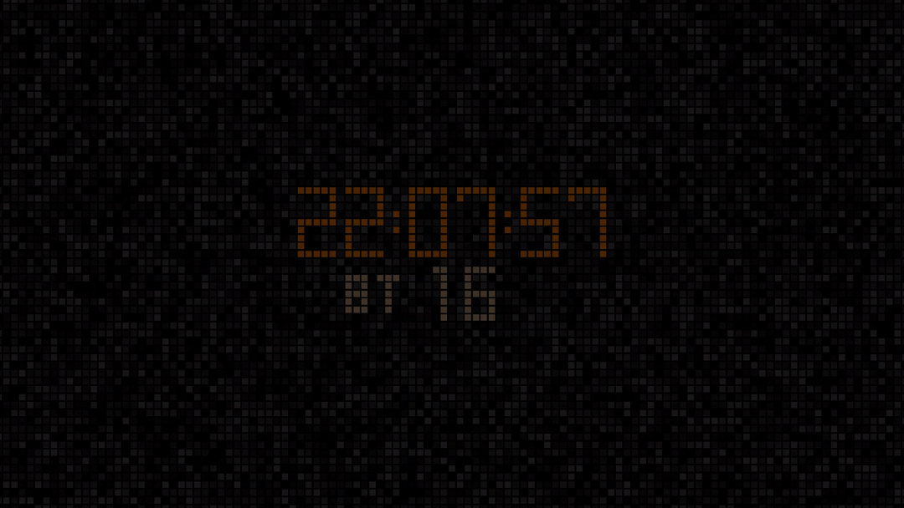

# Digital Watch / Clock Screensaver for MS Windows OpenGL

## Screenshot ver0.5

## Settings: press Keyboard

F1 - open this page

Inc - resize watch

Del - change circles / square watch

PgUP - resize background

PgDown - change circles / square background

End - change circles / square

BACKSPACE - Reset to default

## Build

[codeblocks-20.03mingw](https://www.codeblocks.org/)
