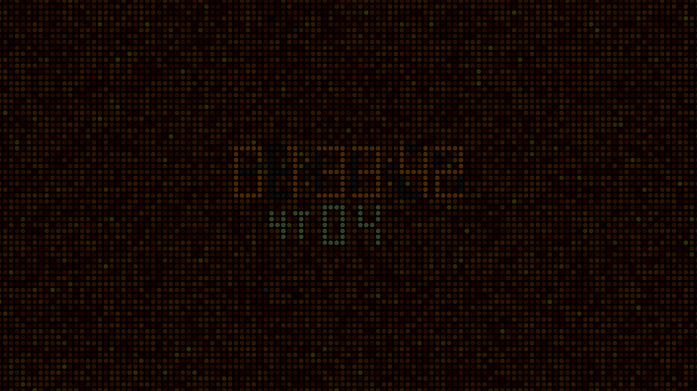

# Bloody Digital Watch / Clock Screensaver for MS Windows OpenGL

## Screenshot ver0.4

## Screenshot ver0.3

## Build
install [MinGW](https://sourceforge.net/projects/mingw/)

MinGw installation Manager install mingw32-base and mingw32-gcc-g++ (6.3.0.1) Packages

Add path to $PATH C:\MinGW\bin

mingw32-make
